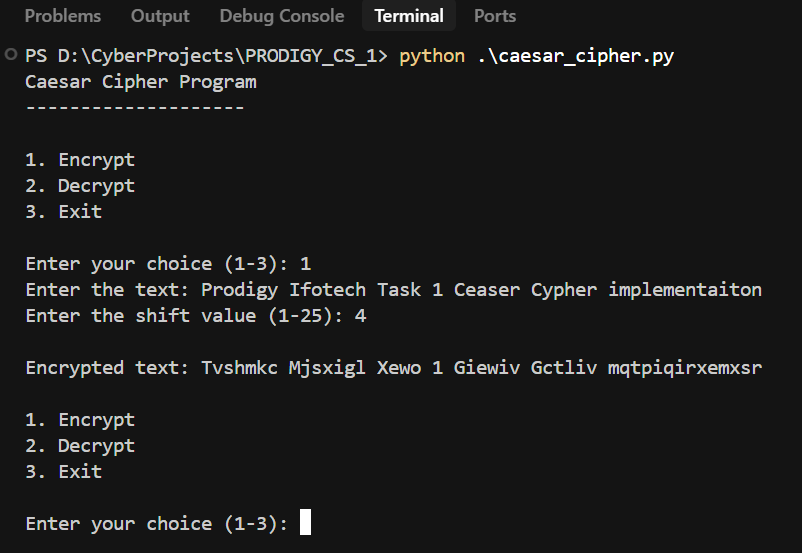
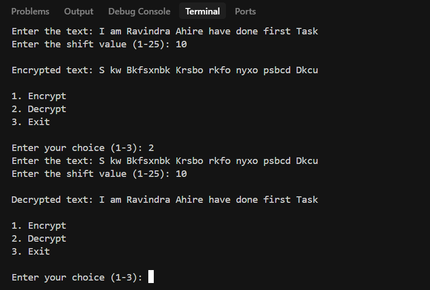
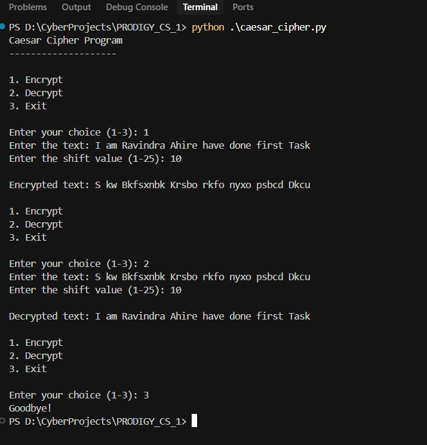

# Caesar Cipher Implementation Report
## Prodigy Infotech - Cyber Security Internship Task 1

### Project Overview
This project implements the Caesar Cipher, one of the simplest and most widely known encryption techniques. It was developed as part of the Cyber Security Internship at Prodigy Infotech to demonstrate fundamental concepts of cryptography and secure communication.

### Implementation Details

#### Core Features
1. **Encryption and Decryption**
   - Supports both encryption and decryption operations
   - Preserves case sensitivity (uppercase/lowercase)
   - Maintains non-alphabetic characters
   - Implements circular shift (wraps around the alphabet)

2. **User Interface**
   - Command Line Interface (CLI) based application
   - Interactive menu system
   - Input validation for shift values
   - Clear output formatting

3. **Security Features**
   - Shift value range limitation (1-25)
   - Input validation
   - Error handling for invalid inputs

#### Technical Implementation
```python
def caesar_cipher(text, shift, mode='encrypt'):
    # Implementation details
    # - Handles both encryption and decryption
    # - Uses ASCII values for character manipulation
    # - Implements modular arithmetic for circular shift
```

### Program Screenshots

#### Main Menu and Encryption

*The program's main menu and encryption process in action*

#### Decryption Process

*Example of the decryption process*

#### Error Handling

*Example of input validation and error messages*

### Working Guide

#### Installation
1. Ensure Python 3.x is installed on your system
2. Save the `caesar_cipher.py` file to your local machine

#### Usage Instructions
1. Open a terminal/command prompt
2. Navigate to the directory containing the script
3. Run the program using: `python caesar_cipher.py`

#### Step-by-Step Operation
1. **Starting the Program**
   ```
   Caesar Cipher Program
   --------------------
   
   1. Encrypt
   2. Decrypt
   3. Exit
   ```

2. **Encryption Process**
   - Select option 1
   - Enter the text to encrypt
   - Enter shift value (1-25)
   - View encrypted result

3. **Decryption Process**
   - Select option 2
   - Enter the encrypted text
   - Enter the same shift value used for encryption
   - View decrypted result

### Example Usage

#### Actual Program Output
```
Caesar Cipher Program
--------------------

1. Encrypt
2. Decrypt
3. Exit

Enter your choice (1-3): 1
Enter the text: I am Ravindra Ahire have done first Task
Enter the shift value (1-25): 10

Encrypted text: S kw Bkfsxnbk Krsbo rkfo nyxo psbcd Dkcu

1. Encrypt
2. Decrypt
3. Exit

Enter your choice (1-3): 2
Enter the text: S kw Bkfsxnbk Krsbo rkfo nyxo psbcd Dkcu
Enter the shift value (1-25): 10

Decrypted text: I am Ravindra Ahire have done first Task

1. Encrypt
2. Decrypt
3. Exit

Enter your choice (1-3): 3
Goodbye!
```

This example demonstrates:
1. Successful encryption of the text "I am Ravindra Ahire have done first Task" with shift value 10
2. Successful decryption of the encrypted text back to the original message
3. Proper program termination

### Features and Limitations

#### Features
1. **User-Friendly Interface**
   - Simple menu-driven system
   - Clear instructions
   - Error messages for invalid inputs

2. **Robust Implementation**
   - Handles all alphabetic characters
   - Preserves case and special characters
   - Implements proper wrapping around the alphabet

3. **Security Considerations**
   - Input validation
   - Shift value constraints
   - Error handling

#### Limitations
1. Basic encryption method (not suitable for secure communications)
2. Limited to alphabetic characters
3. Fixed shift value range (1-25)

### Learning Outcomes
1. Understanding of basic cryptographic concepts
2. Implementation of substitution cipher
3. Working with character manipulation
4. Development of CLI applications
5. Input validation and error handling

### Future Enhancements
1. Support for multiple languages
2. File encryption/decryption
3. Brute force decryption option
4. GUI implementation
5. Additional cipher methods

### Conclusion
This implementation of the Caesar Cipher serves as an excellent introduction to cryptography and secure communication. While simple, it demonstrates fundamental concepts that are essential in the field of cybersecurity. The project successfully meets the requirements of Task 1 in the Prodigy Infotech Cyber Security Internship program.

---
*Report prepared as part of Cyber Security Internship at Prodigy Infotech* 